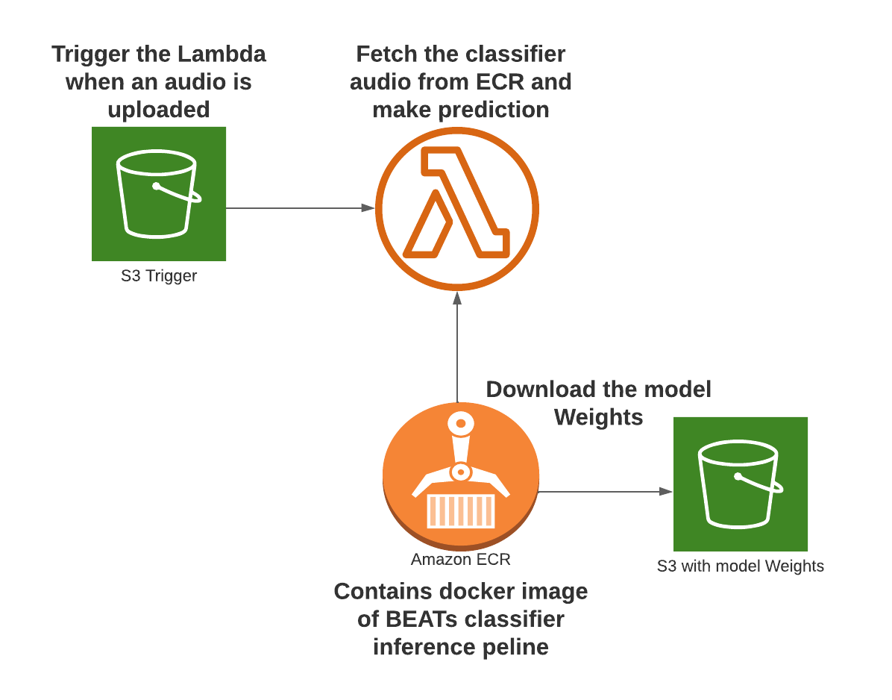

# BEATs Serverless Implementation Guide

In this post, we will walk through a step-by-step guide on implementing ["BEATs"](https://github.com/microsoft/unilm/tree/master/beats), a state-of-the-art audio classification model, using the ["ESC-50"](https://github.com/karolpiczak/ESC-50) (1st place) and ["Audioset"](https://research.google.com/audioset/) (4th place) datasets.

The implementation will leverage AWS serverless tools and Pytorch.

## Overview

Here's a graphical representation of the steps we'll follow:



## Getting Started

1. Open the `app.py` script and provide the S3 bucket name where you'll store the model weights and the desired `filename.pt`. You don't need to create the bucket now, but remember the names.

2. Upload the image to Amazon Elastic Container Registry (ECR):

   - Go to AWS ECR, create a repository, and access the repository.
   - Click on "View Push commands" to get the commands.
   
```
ws ecr get-login-password --region us-east-1 | docker login --username AWS --password-stdin 410677554255.dkr.ecr.us-east-1.amazonaws.com
docker build -t beats_prueba .
docker tag beats_prueba:latest 410677554255.dkr.ecr.us-east-1.amazonaws.com/beats_prueba:latest
docker push 410677554255.dkr.ecr.us-east-1.amazonaws.com/beats_prueba:latest
```


3. Create and Configure Lambda Function:

- Go to AWS Lambda Function, click "Create Function."
- Choose "Container Image," and select the image from the ECR.

4. Setting up S3 Buckets:

- Create two S3 buckets:
  - One for hosting model weights (you can download them from the BEATs repo).
  - Another for triggering the lambda with audio files.

5. Configuring Trigger:

- In Lambda Configuration, add a trigger and select the audio-triggering S3 bucket.

6. Permissions:

- Grant necessary permissions to Lambda for S3 access:

```json
{
    "Version": "2012-10-17",
    "Statement": [
        {
            "Effect": "Allow",
            "Action": ["s3:ListBucket"],
            "Resource": ["arn:aws:s3:::YOUR_BUCKET_NAME"]
        },
        {
            "Effect": "Allow",
            "Action": ["s3:GetObject"],
            "Resource": ["arn:aws:s3:::YOUR_BUCKET_NAME/*"]
        }
    ]
}
```
6. Lambda Configuration:

Set memory to 1512MB and timeout to 1 minute and 30 seconds.
Testing the Model
Upload an audio file to the trigger S3 bucket.

Go to "Monitor" and "View Cloudwatch logs" to observe script logs and final inference results.


Remember to replace placeholders like `YOUR_BUCKET_NAME`.

